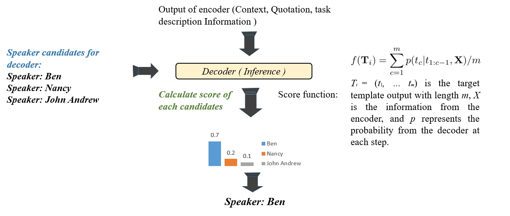

# SIG

----------

This repository contains code for **SIG.**

[SIG: Speaker Identification in Literature via Prompt-Based Generation](https://arxiv.org/pdf/2312.14590.pdf)

Zhenlin Su, Liyan Xu, Jin Xu, Jiangnan Li, Mingdu Huangfu

___
# 
# Introduction
Speaker identification in literary text aims at identifying the speaker of quotation in narrative genres Our method is identifying the speaker via Prompt-Based Generation: Prompting the generation model like BART to get the generation score to identify the speaker. 

The main idea of SIG is consists of two parts:

 1.  **Prompt designed:** The training input (X) and the training label (Y) are accompanied by the appropriate prompt. Natural language prompt is added after quotation to close to the MLM training method of the pre-trained model. The training tag is preceded by a prefix prompt, such as **"Speaker: Y"**, which allows the model to predict the speaker based on the input and prefix. 
    
 2.  **Classification by Generation:** SIG calculate the generation probability of each candidate speaker to make better use of prior knowledge and limit the range of options for the final answer.
    

By changing the method of prompt and selection of candidates, SIG can be used for many tasks.

# Requirements:

 - pytorch==1.8.1
 - transformers==4.4.1
 - jieba==0.42.1
 - spacy==3.6.1

# Contact
If you have any problems, raise an issue or contact suzhenlin75@gmail.com